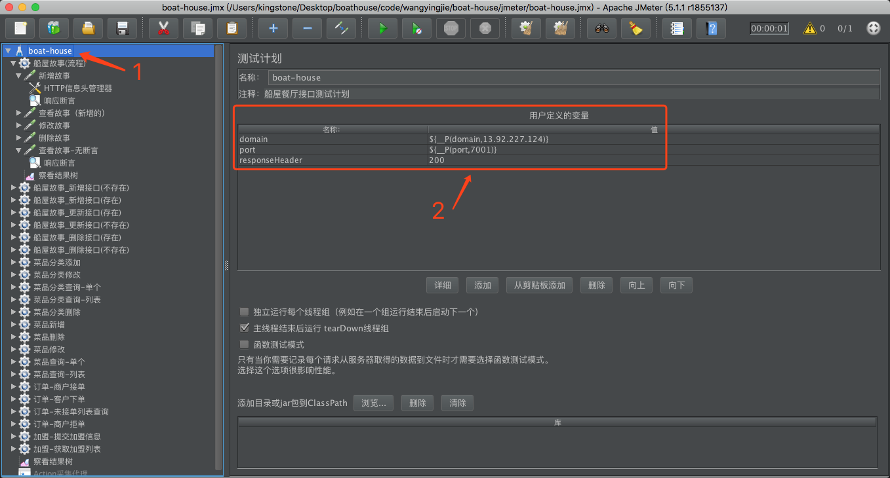
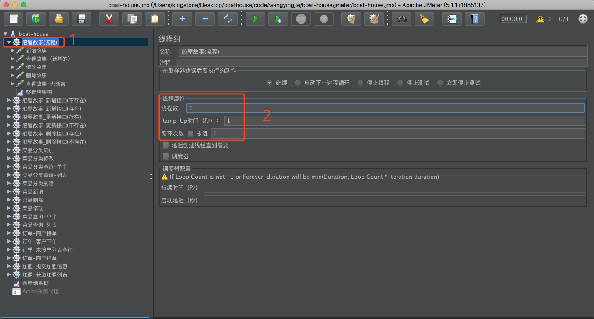
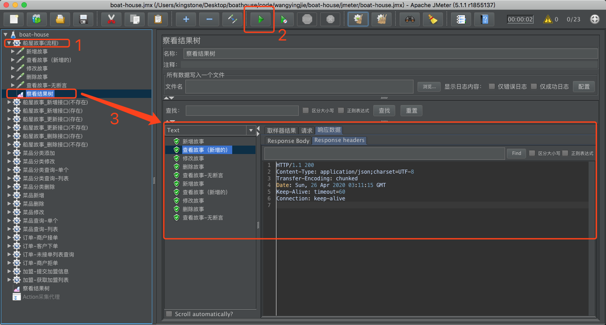
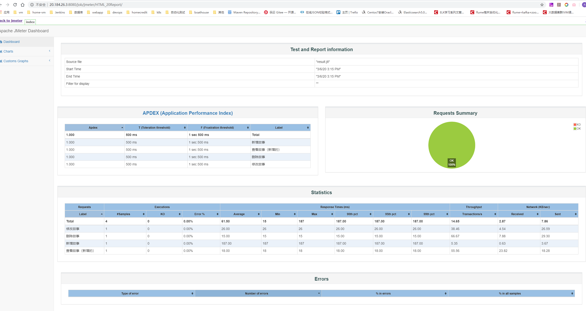

# jmeter自动化测试及流水线集成

- JMeter安装及简介
- JMeter接口测试编写
- 自动化测试执行及结果查看
- Jenkins流水线集成

----------
## 一、JMeter安装及简介

### 1、JMeter安装步骤

- 安装JDK
- 安装JMeter

### 2、安装JDK
	
&nbsp;&nbsp;&nbsp;&nbsp;如果你在终端（Terminal）输入 `java -version` ，可以得到JDK的版本，并且是Java 8以上，那就可以跳过这一步。
&nbsp;&nbsp;&nbsp;&nbsp;下载地址：https://www.oracle.com/java/technologies/javase-downloads.html 
&nbsp;&nbsp;&nbsp;&nbsp;安装过程简单，按“继续”按钮一直下一步即可。
<br/>
&nbsp;&nbsp;&nbsp;&nbsp;JDK安装成功后，需要配置环境变量，在Windows下需要配置的环境变量是 "JAVA_HOME”、"path”、"classpath"，Mac下也是类似。

- JAVA_HOME：指向JDK的安装目录；
- path：指定命令搜索路径，设置好path变量后，就可以在任何目录下执行javac/java等工具了；

&nbsp;&nbsp;&nbsp;&nbsp;在.bash_profile文件中进行环境变量的配置，打开终端，输入 `vim ~/.bash_profile` ，输入以下代码
``` 
export JAVA_8_HOME=/Library/Java/JavaVirtualMachines/jdk1.8.0_181.jdk/Contents/Home # 等号右边的路径目录，可以通过/usr/libexec/java_home -V这个命令得到
export JAVA_HOME=$JAVA_8_HOME # 设置一个中间变量，为了方便多个JDK版本时更换JAVA_HOME
export PATH=$JAVA_HOME/bin:$PATH:. #冒号前代表JDK目录下的bin目录，冒号后代表当前目录
``` 
编辑完成后，在终端中输入 `source ~/.bash_profile` ，作用是让这个配置文件在修改后立即生效。

### 3、安装JMeter

&nbsp;&nbsp;&nbsp;&nbsp;下载地址：http://jmeter.apache.org/download_jmeter.cgi 
&nbsp;&nbsp;&nbsp;&nbsp;进入JMeter的[下载地址](http://jmeter.apache.org/download_jmeter.cgi)页面，如下图，有两个版本可供下载：
  - Binaries：二进制版，即已经编译好、可直接执行；
  - Source：源代码版，需要自己编译；
下载Binaries版本，下载完成后直接双击解压，也可以通过终端输入 `tar zxvf apache-jmeter-5.0.tgz` 解压。

&nbsp;&nbsp;&nbsp;&nbsp;解压完成后，进入到bin目录下，通过 `sh jmeter` 命令来启动JMeter。

----------
## 二、JMeter接口测试编写


### 1、新建测试计划

如上图所示：
1：新建测试计划boat-house
2：创建3个用户变量：
`domain : ${__P(domain,13.92.227.124)}`
`port : ${__P(port,7001)}`
`responseHeader : 200`
 `__P() `的意思是该参数可以通过JMeter命令行模式，以 `-J` 参数设置变量的属性，且 ` ()`的第二个参数是默认值。第四节流水线中有介绍

### 2、新建线程组


如上图所示：
1:新建线程组：船屋故事(流程)
2:设置线程组-线程属性：
 ` 线程数：1`
 ` Ram-Up时间（秒）：1`
 ` 循环次数：1`
该配置用于接口功能测试，不用于接口性能测试
3: 配置结果数

### 3、新建取样器-http请求

如上图所示：
1: 新建取样器-http请求：新增故事
&nbsp;&nbsp;包括HTTP信息头管理、响应断言的配置
2: 设置请求参数和消息体：
 ` Web服务器：http://${domain}:${port}`
 ` HTTP请求：POST形式  /api/v1.0/intro/intro_page`
 ` 消息体：json数据`
3: HTTP信息头配置；
4: 响应断言配置；

----------
## 三、自动化测试执行及结果查看

如上图所示：
1、选中需要执行的线程组：船屋故事(流程)
2、点击菜单栏绿色三角形箭头，执行该线程组
3、点击察看结果数，查询执行情况（包括正常异常请求、请求及响应数据）
4、清空执行记录

----------

## 四、Jenkins流水线集成

### 1 Jenkinsfile集成JMeter脚本详解
``` 
stage('Jmeter') {
  steps {
    script{
      echo "waitting for the sevice up...."
      sleep 80
      sh "ls -al ./jmeter"
      sh "cd jmeter &amp;&amp; find . -name '*.log' -delete"
      sh "rm -R ./jmeter/output || exit 0"
      sh "mkdir ./jmeter/output"
      sh "docker run --interactive --rm --volume `pwd`/jmeter:/jmeter egaillardon/jmeter --nongui --testfile boat-house.jmx --logfile output/result.jtl -Jdomain=${BOATHOUSE_DEV_HOST} -e -o ./output"
      sh "ls -al ./jmeter"
      publishHTML([allowMissing: false, alwaysLinkToLastBuild: false, keepAll: true, reportDir: './jmeter/output', reportFiles: 'index.html', reportName: 'Jmeter Report', reportTitles: ''])
      }
    }
  }

``` 

### 2、流水线执行效果


